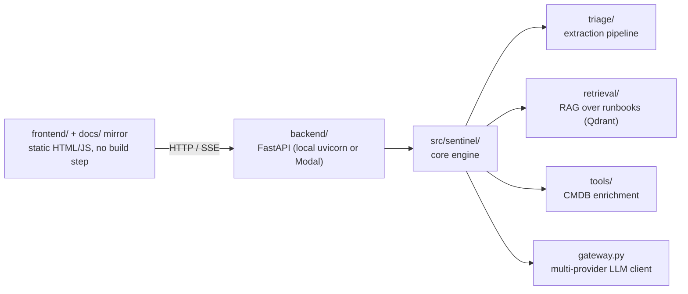
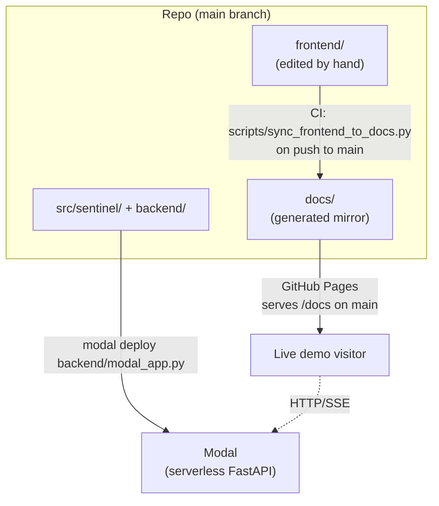
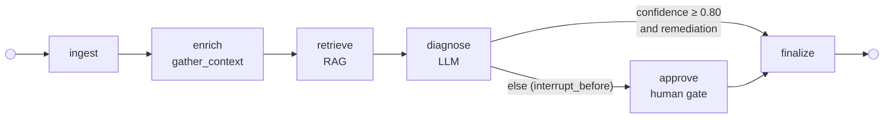

# Architecture

## Request flow

- **Frontend**: static HTML/JS demo UI, no build step. `app.js` auto-detects
  environment — `localhost`/`127.0.0.1` targets a local backend at
  `http://localhost:8000`; anywhere else targets the deployed Modal backend.
- **Backend**: plain FastAPI app (`backend/demo_app.py`), deployable locally
  (`uvicorn`) or serverless (Modal, via `backend/modal_app.py`). Same router
  and endpoints in both environments — no separate API surface.
- **Core engine** (`src/sentinel/`): installable package with the triage
  pipeline, RAG retrieval, and tool-calling layer, independent of the
  FastAPI/Modal wrapper around it.

## Deployment targets

`frontend/` is the working copy; `docs/` exists only because GitHub Pages is
dashboard-configured to serve `/docs` on `main`. The two are kept identical by
[`scripts/sync_frontend_to_docs.py`](https://github.com/anjeshdubey/sentinel/blob/main/scripts/sync_frontend_to_docs.py),
run automatically by CI — see [Contributing](contributing.md#frontend-docs-sync)
for the full mechanism. Never edit `docs/*.html`/`.js`/`.css`/`.json` directly.

## Core engine internals

- `triage/engine.py` — the pipeline's reusable steps. `triage_alert()` is the
  frozen linear entry point (Weeks 1–4); it now composes two extracted helpers,
  `retrieve_runbook_context()` (RAG) and `diagnose_incident()` (prompt + LLM +
  assemble `IncidentSummary`), so the graph nodes run the exact same code rather
  than a fork of it. `run_triage_graph()` / `resume_triage_graph()` are the
  graph entry points (LangGraph imported lazily, so the package still imports
  without the optional `graph` extra).
- `triage/graph.py`, `triage/nodes.py`, `models/graph_state.py` — the
  human-in-the-loop triage graph (see below).
- `retrieval/` — Qdrant-backed RAG: frontmatter-aware runbook chunking, a
  BGE-small (384-dim) embedder, hybrid filtered search, and an idempotent
  indexer.
- `tools/` — a provider abstraction for CMDB enrichment (ownership, deploys,
  dependencies, past incidents), with a `json` backend reading fixture data
  and a `real` backend reserved for a future live-API integration.
  `tools/enrichment.py::gather_context()` runs the ownership→deploys sequence
  and renders the prompt enrichment block; both the SSE endpoint and the graph's
  `enrich` node call it, so there is one implementation, not two.
- `gateway.py` — multi-provider LLM client factory (Anthropic, Gemini, Groq)
  behind one `create_completion()` interface, using
  [Instructor](https://github.com/instructor-ai/instructor) for structured
  output.

See [Repository Layout](repository-layout.md) for the full file-by-file
breakdown.

## Human-in-the-loop triage graph

Triage runs as a [LangGraph](https://langchain-ai.github.io/langgraph/) state
machine. A conditional edge after `diagnose` splits on confidence: a confident
diagnosis with a grounded remediation auto-approves and finalizes; anything else
pauses at a human gate until an operator approves or rejects.

- **Routing.** `route_on_confidence` uses `CONFIDENCE_THRESHOLD = 0.80`. A
  high-confidence diagnosis *with* a `proposed_remediation` auto-approves
  (`approval_status = "auto"`); low confidence **or** a missing remediation is
  forced to the gate.
- **Interrupt / resume.** The graph is compiled with a `MemorySaver`
  checkpointer and `interrupt_before=["approve"]`. A gated run pauses with its
  state checkpointed under a `correlation_id`; resuming re-invokes the same
  thread with the human decision. On **reject**, the remediation is cleared so
  it is never surfaced as actionable.
- **Streaming.** `POST /triage/stream` drives the graph and streams each node's
  progress as SSE (`node_start`, `tool_call`/`tool_result`, `rag_query`,
  `llm_call`, `diagnosis`); a gated run ends with an `interrupt` frame carrying
  the `correlation_id`. `POST /triage/resume` finalizes the paused run and
  streams `finalized` → `done`. The `MemorySaver` is in-process, so resume must
  land in the same warm process as its stream — see
  [Deployment § Warm-process resume](deployment.md#warm-process-resume).
