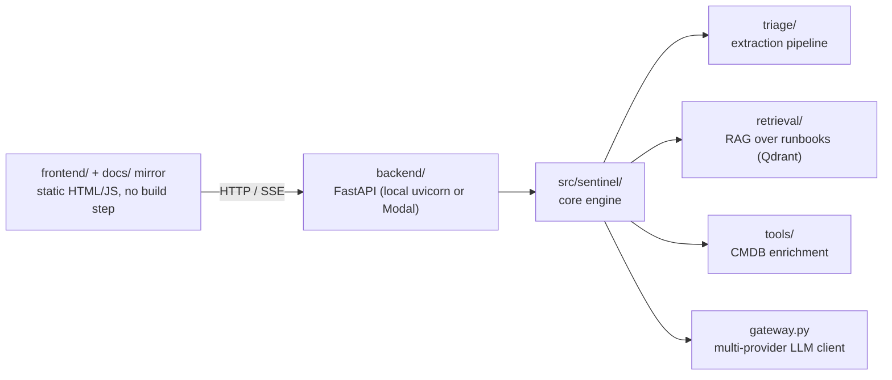
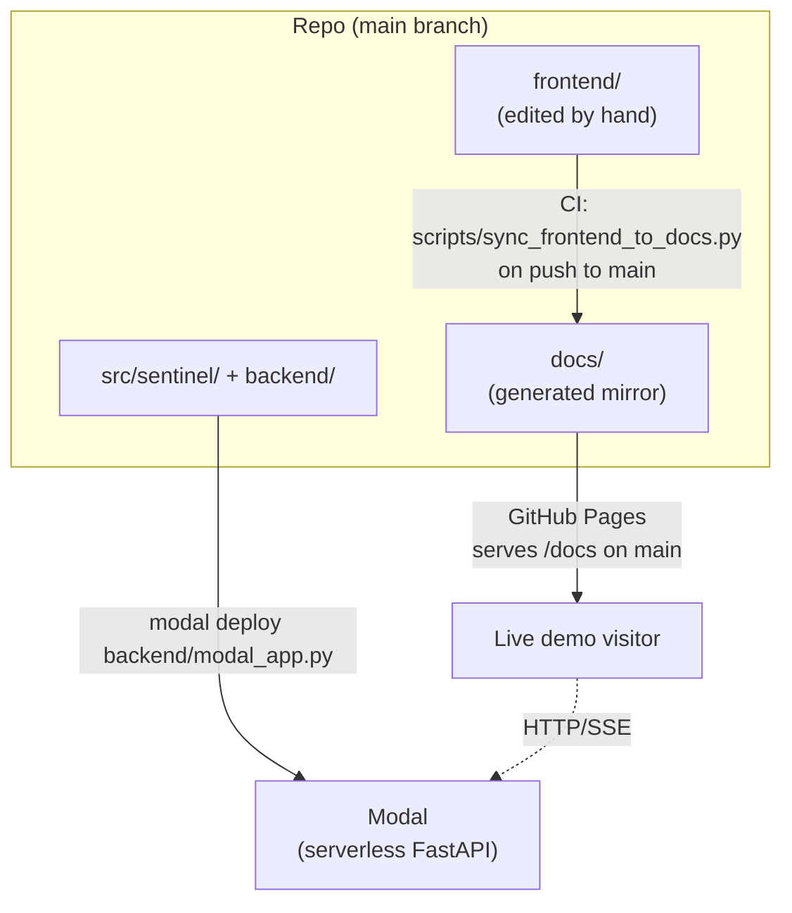

# Architecture

## Request flow

- **Frontend**: static HTML/JS demo UI, no build step. `app.js` auto-detects
  environment — `localhost`/`127.0.0.1` targets a local backend at
  `http://localhost:8000`; anywhere else targets the deployed Modal backend.
- **Backend**: plain FastAPI app (`backend/demo_app.py`), deployable locally
  (`uvicorn`) or serverless (Modal, via `backend/modal_app.py`). Same router
  and endpoints in both environments — no separate API surface.
- **Core engine** (`src/sentinel/`): installable package with the triage
  pipeline, RAG retrieval, and tool-calling layer, independent of the
  FastAPI/Modal wrapper around it.

## Deployment targets

`frontend/` is the working copy; `docs/` exists only because GitHub Pages is
dashboard-configured to serve `/docs` on `main`. The two are kept identical by
[`scripts/sync_frontend_to_docs.py`](https://github.com/anjeshdubey/sentinel/blob/main/scripts/sync_frontend_to_docs.py),
run automatically by CI — see [Contributing](contributing.md#frontend-docs-sync)
for the full mechanism. Never edit `docs/*.html`/`.js`/`.css`/`.json` directly.

## Core engine internals

- `triage/engine.py` — `triage_alert()`, the pipeline entry point: hash alert
  → deterministic ID, retrieve runbook context, build prompt, call the LLM
  extractor, emit trace events, assemble the final `IncidentSummary`.
- `retrieval/` — Qdrant-backed RAG: frontmatter-aware runbook chunking, a
  BGE-small (384-dim) embedder, hybrid filtered search, and an idempotent
  indexer.
- `tools/` — a provider abstraction for CMDB enrichment (ownership, deploys,
  dependencies, past incidents), with a `json` backend reading fixture data
  and a `real` backend reserved for a future live-API integration.
- `gateway.py` — multi-provider LLM client factory (Anthropic, Gemini, Groq)
  behind one `create_completion()` interface, using
  [Instructor](https://github.com/instructor-ai/instructor) for structured
  output.

See [Repository Layout](repository-layout.md) for the full file-by-file
breakdown.
