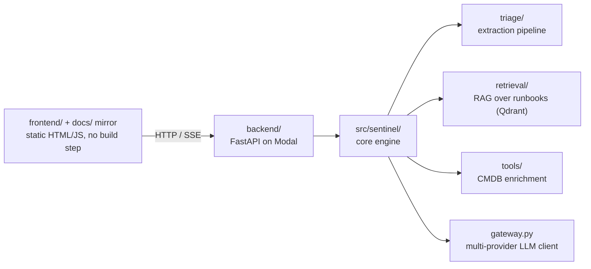
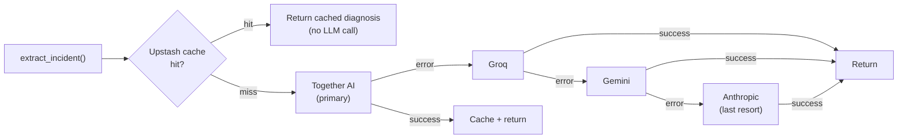
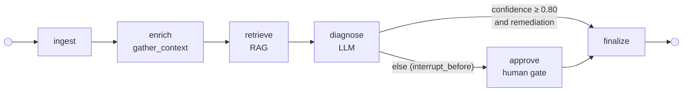

# Architecture

## Request flow

- **Frontend**: static HTML/JS demo UI, no build step, calling the deployed
  Modal backend directly over HTTP/SSE.
- **Backend**: a FastAPI app (`backend/demo_app.py`) deployed serverless on
  [Modal](https://modal.com) (`backend/modal_app.py`), scale-to-zero so it
  costs nothing while idle between recruiter visits.
- **Core engine** (`src/sentinel/`): installable package with the triage
  pipeline, RAG retrieval, and tool-calling layer, independent of the
  FastAPI/Modal wrapper around it.

For how this is deployed (Modal backend, GitHub Pages frontend mirror, secrets)
see [Deployment & Secrets](deployment.md); for a file-by-file breakdown of
`src/sentinel/` see [Repository Layout](repository-layout.md).

## LLM gateway: fallback + caching

A public, unmonetized demo can't rely on a single LLM provider — free tiers
throttle unpredictably, and a raw provider outage shouldn't take the whole
triage run down with it. `gateway.py` builds a priority-ordered chain from
whichever provider keys are configured, and Instructor's structured-output
call is retried against the next provider in the chain on any failure, with
successful responses cached so repeated identical alerts never re-hit the LLM.

- **Priority order**: Together AI → Groq → Gemini → Anthropic. Together AI
  leads because it's a metered paid tier with no free-tier rate-limit
  throttling; Anthropic sits last as the most expensive per call, used only
  when everything else is down. `sentinel.yaml`'s `model.provider` pins which
  one is primary — the rest of the chain is built automatically from whatever
  other provider keys are configured.
- **Fallback**: each of the four providers uses a different SDK with its own
  exception hierarchy, so the chain catches broadly (any failure from a
  provider's completion call) rather than mapping every SDK's specific
  exception types — a rate limit, timeout, or outage from any provider should
  all trigger the same "try the next one" response.
- **Caching**: a successful *primary*-provider response is cached (Upstash,
  exact-match on the request payload) so an identical alert served again
  returns instantly without hitting the LLM at all — a fallback response is
  never cached under the primary's key, so a degraded answer can't get served
  back as if it were the primary's own.

## Human-in-the-loop triage graph

Triage runs as a [LangGraph](https://langchain-ai.github.io/langgraph/) state
machine. A conditional edge after `diagnose` splits on confidence: a confident
diagnosis with a grounded remediation auto-approves and finalizes; anything else
pauses at a human gate until an operator approves or rejects.

- **Routing.** `route_on_confidence` uses `CONFIDENCE_THRESHOLD = 0.80`. A
  high-confidence diagnosis *with* a `proposed_remediation` auto-approves
  (`approval_status = "auto"`); low confidence **or** a missing remediation is
  forced to the gate.
- **Interrupt / resume.** The graph is compiled with a `MemorySaver`
  checkpointer and `interrupt_before=["approve"]`. A gated run pauses with its
  state checkpointed under a `correlation_id`; resuming re-invokes the same
  thread with the human decision. On **reject**, the remediation is cleared so
  it is never surfaced as actionable.
- **Streaming.** `POST /triage/stream` drives the graph and streams each node's
  progress as SSE (`node_start`, `tool_call`/`tool_result`, `rag_query`,
  `llm_call`, `diagnosis`); a gated run ends with an `interrupt` frame carrying
  the `correlation_id`. `POST /triage/resume` finalizes the paused run and
  streams `finalized` → `done`. The `MemorySaver` is in-process, so resume must
  land in the same warm process as its stream — see
  [Deployment § Warm-process resume](deployment.md#warm-process-resume).
