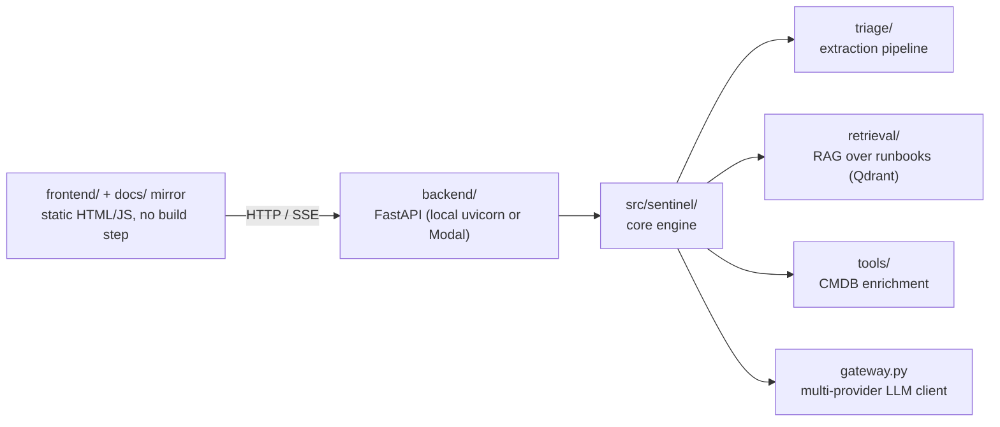
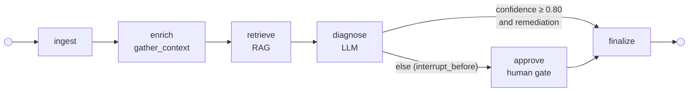

# Architecture

## Request flow

- **Frontend**: static HTML/JS demo UI, no build step. `app.js` auto-detects
  environment — `localhost`/`127.0.0.1` targets a local backend at
  `http://localhost:8000`; anywhere else targets the deployed Modal backend.
- **Backend**: plain FastAPI app (`backend/demo_app.py`), deployable locally
  (`uvicorn`) or serverless (Modal, via `backend/modal_app.py`). Same router
  and endpoints in both environments — no separate API surface.
- **Core engine** (`src/sentinel/`): installable package with the triage
  pipeline, RAG retrieval, and tool-calling layer, independent of the
  FastAPI/Modal wrapper around it.

For how this is deployed (Modal backend, GitHub Pages frontend mirror, secrets)
see [Deployment & Secrets](deployment.md); for a file-by-file breakdown of
`src/sentinel/` see [Repository Layout](repository-layout.md).

## Human-in-the-loop triage graph

Triage runs as a [LangGraph](https://langchain-ai.github.io/langgraph/) state
machine. A conditional edge after `diagnose` splits on confidence: a confident
diagnosis with a grounded remediation auto-approves and finalizes; anything else
pauses at a human gate until an operator approves or rejects.

- **Routing.** `route_on_confidence` uses `CONFIDENCE_THRESHOLD = 0.80`. A
  high-confidence diagnosis *with* a `proposed_remediation` auto-approves
  (`approval_status = "auto"`); low confidence **or** a missing remediation is
  forced to the gate.
- **Interrupt / resume.** The graph is compiled with a `MemorySaver`
  checkpointer and `interrupt_before=["approve"]`. A gated run pauses with its
  state checkpointed under a `correlation_id`; resuming re-invokes the same
  thread with the human decision. On **reject**, the remediation is cleared so
  it is never surfaced as actionable.
- **Streaming.** `POST /triage/stream` drives the graph and streams each node's
  progress as SSE (`node_start`, `tool_call`/`tool_result`, `rag_query`,
  `llm_call`, `diagnosis`); a gated run ends with an `interrupt` frame carrying
  the `correlation_id`. `POST /triage/resume` finalizes the paused run and
  streams `finalized` → `done`. The `MemorySaver` is in-process, so resume must
  land in the same warm process as its stream — see
  [Deployment § Warm-process resume](deployment.md#warm-process-resume).
