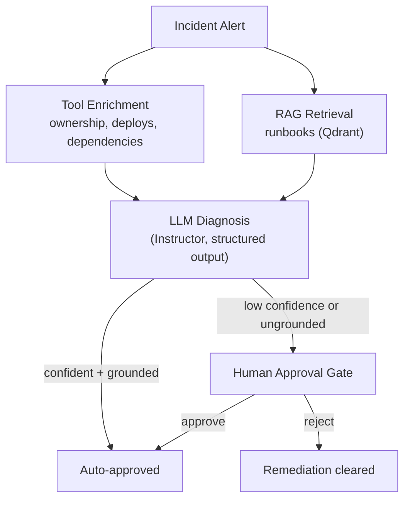

# Sentinel — Engineering Docs

Sentinel is an LLM-powered agent that reads incident alerts, retrieves relevant
runbooks (RAG), calls tools to gather context (ownership, deploys, dependencies,
past incidents), produces a structured diagnosis, and — when confidence is low
or no grounded remediation exists — pauses for human approval before its
remediation is treated as actionable. The whole run streams to a browser as a
live trace.

Structured extraction is done directly on provider SDKs +
[Instructor](https://github.com/instructor-ai/instructor); a thin
[LangGraph](https://langchain-ai.github.io/langgraph/) state machine orchestrates
the human-in-the-loop approval flow (interrupt at the gate, resume on decision).
LLM calls run through a resilient multi-provider gateway (Together AI, Groq,
Gemini, Anthropic) with automatic fallback and response caching, so the demo
stays reliable without leaning on any single provider's free tier.

**Live demo:** <https://anjeshdubey.github.io/sentinel/>

This site is for people extending or operating Sentinel. If you just want to
see it work, use the live demo above instead.

---

## Core pillars

### Context enrichment

Before reasoning about an incident, Sentinel gathers ownership, recent deploys,
dependency graph, and past-incident context via a pluggable tool provider —
so the LLM diagnoses against real system state, not just the alert text.

### RAG over runbooks

Incident context is matched against a Qdrant-backed runbook index so
diagnoses are grounded in documented remediation steps rather than the
model's own guesses.

### Structured diagnosis

Provider SDKs + [Instructor](https://github.com/instructor-ai/instructor)
extract a structured `IncidentSummary` (confidence, root cause, proposed
remediation) directly — no separate parsing layer.

### Human-in-the-loop gate

A [LangGraph](https://langchain-ai.github.io/langgraph/) state machine
auto-approves confident, grounded diagnoses and pauses everything else at a
human gate — remediation is only actionable after approval, or never
surfaced if rejected.

### Live streaming trace

Every run streams node-by-node progress (tool calls, RAG queries, LLM calls,
the diagnosis, the approval interrupt) to the browser over SSE.

### Resilient LLM gateway

LLM calls automatically fail over across a priority-ordered chain of
providers (Together AI, Groq, Gemini, Anthropic) and cache successful
responses — a single provider outage or rate limit never breaks a run. See
[Architecture § LLM gateway](architecture.md#llm-gateway-fallback-caching)
for the design.

---

## Where to start

- [Architecture](architecture.md) — how the pieces fit together
- [Repository Layout](repository-layout.md) — what's in each directory
- [Testing Strategy](testing.md) — what's covered, what isn't, how to run it
- [Deployment & Secrets](deployment.md) — Modal + GitHub Pages, provider keys
- [Contributing](contributing.md) — local dev setup, PR checklist, docs workflow
- [Architecture Decisions](adr/index.md) — why things are built the way they are

## Source of truth

This site is generated from `engineering-docs/` and rebuilt automatically on
every merge to `main` — see [Contributing](contributing.md) for how the CI
publish job works. The root [`README.md`](https://github.com/anjeshdubey/sentinel/blob/main/README.md)
stays the canonical quick-reference for anyone browsing the repo directly on
GitHub; this site goes deeper for people working in the codebase day to day.
