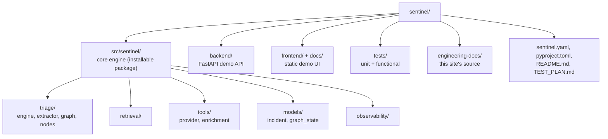

# Repository Layout

## Directory map

| Directory | Purpose |
|---|---|
| `src/sentinel/` | Core engine — installable package with the triage pipeline (`triage/engine.py`), the LangGraph human-in-the-loop graph (`triage/graph.py`, `triage/nodes.py`, `models/graph_state.py`), RAG retrieval, and the tool-calling / enrichment layer, independent of the FastAPI/Modal wrapper. |
| `backend/` | Plain FastAPI demo API — `demo_app.py` (app + guardrails middleware), `demo_endpoints.py` (routes), `modal_app.py` (serverless wrapper). |
| `frontend/` + `docs/` | Static HTML/JS demo UI, no build step. `frontend/` is the working copy; `docs/` is a generated GitHub Pages mirror — see [Architecture](architecture.md#deployment-targets). |
| `tests/` | `unit/` (isolated module tests) + `functional/` (real FastAPI app + full pipeline, external services faked) — see [Testing Strategy](testing.md). |
| `engineering-docs/` | Source for this site, built by MkDocs into `docs/engineering/`. |
| `data/` | Seed data — CMDB fixtures, runbooks, past incidents, checked-in Qdrant collection. |
| `scripts/` | One-off/CI scripts (`index_seed_data.py`, `sync_frontend_to_docs.py`). |

**The authoritative, file-by-file breakdown lives in the root
[`README.md`](https://github.com/anjeshdubey/sentinel/blob/main/README.md#repository-layout)**
— this page is a map, not a duplicate. Keeping one detailed table (README's,
enforced fresh via the PR checklist) avoids the exact kind of drift this docs
project exists to prevent, rather than maintaining two copies that silently
diverge.
