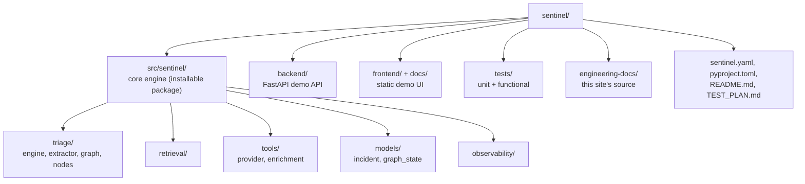

# Repository Layout

## Directory map

| Directory | Purpose |
|---|---|
| `src/sentinel/` | Core engine — installable package with the triage pipeline (`triage/engine.py`), the LangGraph human-in-the-loop graph (`triage/graph.py`, `triage/nodes.py`, `models/graph_state.py`), RAG retrieval, and the tool-calling / enrichment layer, independent of the FastAPI/Modal wrapper. |
| `backend/` | Plain FastAPI demo API — `demo_app.py` (app + guardrails middleware), `demo_endpoints.py` (routes), `modal_app.py` (serverless wrapper). |
| `frontend/` + `docs/` | Static HTML/JS demo UI, no build step. `frontend/` is the working copy; `docs/` is a generated GitHub Pages mirror — see [Deployment & Secrets](deployment.md). |
| `tests/` | `unit/` (isolated module tests) + `functional/` (real FastAPI app + full pipeline, external services faked) — see [Testing Strategy](testing.md). |
| `engineering-docs/` | Source for this site, built by MkDocs into `docs/engineering/`. |
| `data/` | Seed data — CMDB fixtures, runbooks, past incidents, checked-in Qdrant collection. |
| `scripts/` | One-off/CI scripts (`index_seed_data.py`, `sync_frontend_to_docs.py`). |

## Core engine internals (`src/sentinel/`)

- `triage/engine.py` — the pipeline's reusable steps. `triage_alert()` is the
  frozen linear entry point (Weeks 1–4); it now composes two extracted helpers,
  `retrieve_runbook_context()` (RAG) and `diagnose_incident()` (prompt + LLM +
  assemble `IncidentSummary`), so the graph nodes run the exact same code rather
  than a fork of it. `run_triage_graph()` / `resume_triage_graph()` are the
  graph entry points (LangGraph imported lazily, so the package still imports
  without the optional `graph` extra).
- `triage/graph.py`, `triage/nodes.py`, `models/graph_state.py` — the
  human-in-the-loop triage graph — see
  [Architecture § Human-in-the-loop triage graph](architecture.md#human-in-the-loop-triage-graph).
- `retrieval/` — Qdrant-backed RAG: frontmatter-aware runbook chunking, a
  BGE-small (384-dim) embedder, hybrid filtered search, and an idempotent
  indexer.
- `tools/` — a provider abstraction for CMDB enrichment (ownership, deploys,
  dependencies, past incidents), with a `json` backend reading fixture data
  and a `real` backend reserved for a future live-API integration.
  `tools/enrichment.py::gather_context()` runs the ownership→deploys sequence
  and renders the prompt enrichment block; both the SSE endpoint and the graph's
  `enrich` node call it, so there is one implementation, not two.
- `gateway.py` — multi-provider LLM client factory (Anthropic, Gemini, Groq)
  behind one `create_completion()` interface, using
  [Instructor](https://github.com/instructor-ai/instructor) for structured
  output.

**The authoritative, file-by-file breakdown lives in the root
[`README.md`](https://github.com/anjeshdubey/sentinel/blob/main/README.md#repository-layout)**
— this page is a map, not a duplicate. Keeping one detailed table (README's,
enforced fresh via the PR checklist) avoids the exact kind of drift this docs
project exists to prevent, rather than maintaining two copies that silently
diverge.
